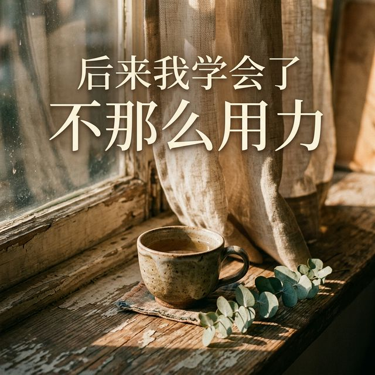
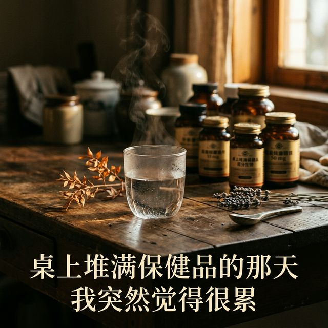
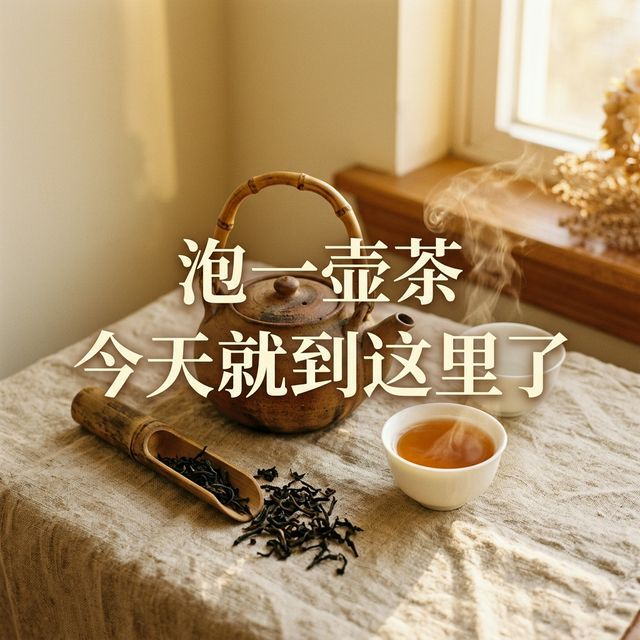

# 初序 · 小红书 3 天测试内容（终稿）
> 松弛 · 东方 · 自愈 | 2026-03-25

---

## Day 1

**封面**：

**标题**：怎么睡都睡不够的那段时间，我差点以为自己病了

---

睡了十个小时。

醒来第一个念头——
还能不能再睡一会儿。

·

不是困。
是整个人被抽空了。

刷牙看镜子，脸是肿的。
出门觉得太阳刺眼。
坐到工位上，
盯着屏幕发了十分钟呆，
不知道先做哪一件。

·

去查了血。正常。
逼自己十点上床。越逼越睡不着。
买了褪黑素。吃完更晕。
下载了冥想app。听了两分钟就烦了。

越"努力休息"，
越觉得连休息都做不好。

·

有天下班。
路过楼下那棵树。

风不大。
叶子在很慢很慢地晃。

我就站在那。
没想什么。也没打算站多久。

风吹到脸上的时候，
突然觉得——

这好像是今天第一次
感觉自己活着。

·

后来我只改了一件事。

到家以后，不立刻打开手机。
坐着。
看窗外。或者什么也不看。

五分钟。有时候十分钟。

不是冥想。不是正念。不是任何需要学的东西。
就是——
允许自己什么身份都不用扮演。

不是妈妈。不是员工。不是谁的谁。
就是一个人坐在那里。呼吸。

·

那段怎么睡都睡不够的日子，
就是这样过去的。

没什么大道理。

身体等了很久，
终于等到你不再催它了。

☁️

---

你有过那种"不是困，但就是累"的日子吗

A 有。现在就是
B 以前有，后来慢慢好了

#初序 #后来我学会了 #睡不够 #松弛感
#允许自己休息 #身体比你先知道答案
#慢生活 #不那么用力

---
---

## Day 2

**封面**：

**标题**：吃了三年保健品，体检单上该高的还是高

---

我妈说我桌上像开药店。

也没说错。

鱼油。叶黄素。胶原蛋白。
维D。B族。辅酶Q10。
最多的时候七八瓶。
每天早上吞一轮。

有种说不上来的安全感。
好像吃了这些
我就在对自己好了。
好像这就叫养生了。

·

今年体检报告出来。

尿酸——偏高。
脂肪肝——还在。
维D——讽刺的是——还是不够。

坐在医院走廊的塑料椅上，
看着那张纸，
突然不想再"补"了。

·

后来问了个学中医的朋友。

她没叫我停药。
她问了我一句：

"你每天醒来，第一口是什么？"

我想了两秒。

手机。

不是水。不是饭。是手机。

每天早上睁眼先看消息。看日程。看昨晚谁回了谁没回。
然后匆匆喝口水，吞一把药片。出门。

她说——

"你塞了那么多好东西进去，
可你的身体，
连一碗粥都消化不动。"

·

那天回去。
桌上的瓶子我没全扔。
但推到了角落。

开始做一件事——

早上先吃东西。再看手机。

就这一件。

哪怕只是两口温水。
哪怕只是半碗昨晚剩的粥。

先让胃暖起来。
再让脑子转起来。

·

一个月以后，
那种"吃了一堆又好像什么用都没有"的感觉，
变淡了。

不是保健品没用。
是我一直搞错了顺序。

☁️

---

你早上醒来第一口是什么

A 手机
B 水或早餐

#初序 #保健品 #养生做减法 #体检
#松弛感 #少即是多 #慢养
#身体比你先知道答案

---
---

## Day 3

**封面**：

**标题**：允许自己什么都不做以后，反而把很多事想通了

---

我休息的时候
脑子比上班还忙。

躺在沙发上看天花板。
想方案交了没有。
想那条消息回得是不是太冷了。
想周末该不该见那个人。
想冰箱里的菜是不是要坏了。

身体躺着。
脑子一秒都没停过。

·

有天下午。
难得什么事都做完了。

柜子里有一盒别人送的老白茶。
一直没拆。
那天拆了。

按壶上印的小字泡了一次。

等水开的时候站在厨房。
听壶在响。

倒出来的茶颜色很淡。
像琥珀。

端到窗边。坐下。喝了一口。

·

那一口没什么特别的味道。

但整个人好像被按了暂停键。

窗外有个小孩在喊谁。
空调外机在嗡嗡转。
对面楼有人在晾床单。

全是平时听不到的声音。

·

不是茶有什么魔力。

是我太久没有
"什么都不做"地待过了。

我们对自己太狠了。
连休息都要高效——

看书。听播客。学英语。
做拉伸。做face yoga。
刷"如何高效利用碎片时间"。

连发呆都觉得是在浪费生命。

·

有没有可能——

偶尔让自己
"浪费"十五分钟。

不看手机。
不学东西。
不思考人生。

就看看窗外。
听听水壶响。

·

你上一次这么安静地坐着
是什么时候的事了

A 想不起来了
B 就是现在

☁️

#初序 #泡茶 #什么都不做 #松弛感
#慢生活 #允许自己慢下来 #治愈
#自我关怀 #东方美学
