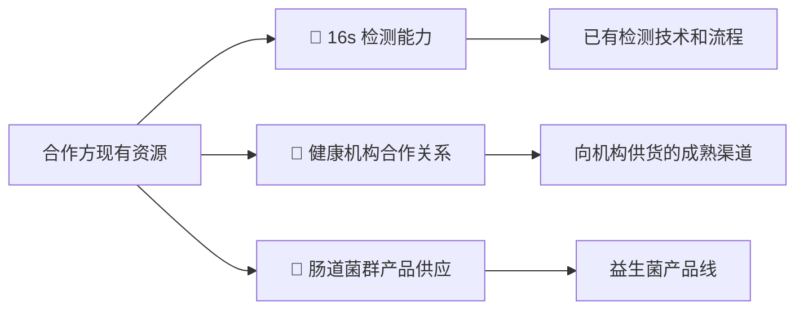
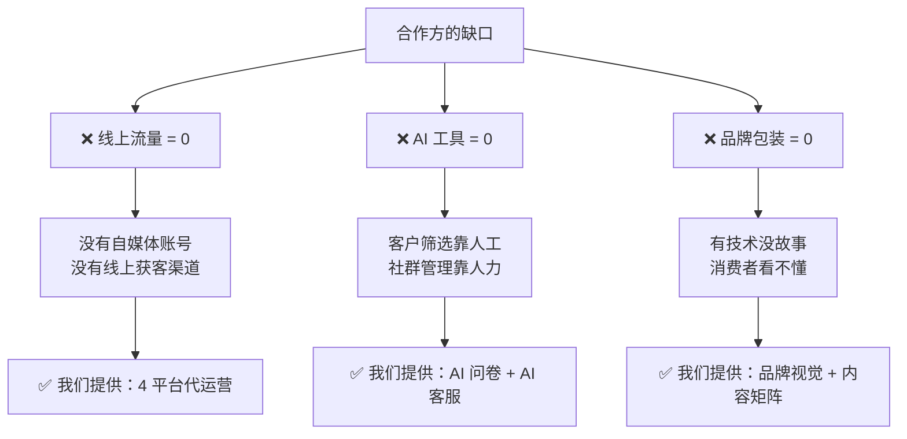
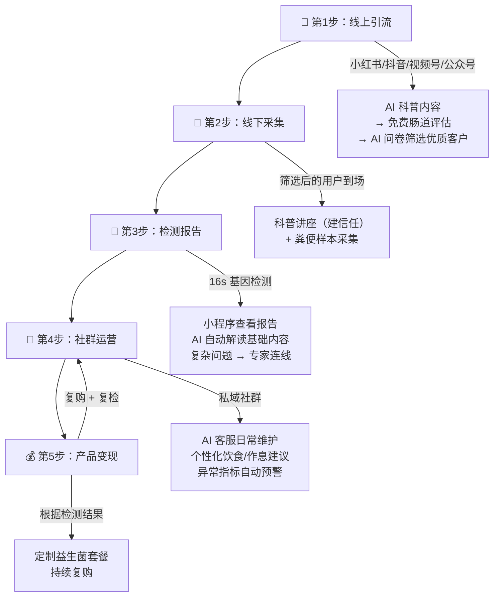
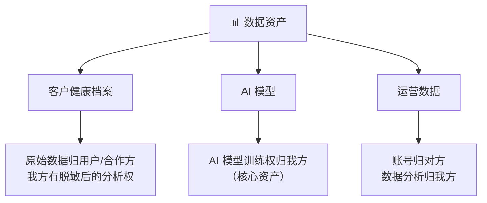
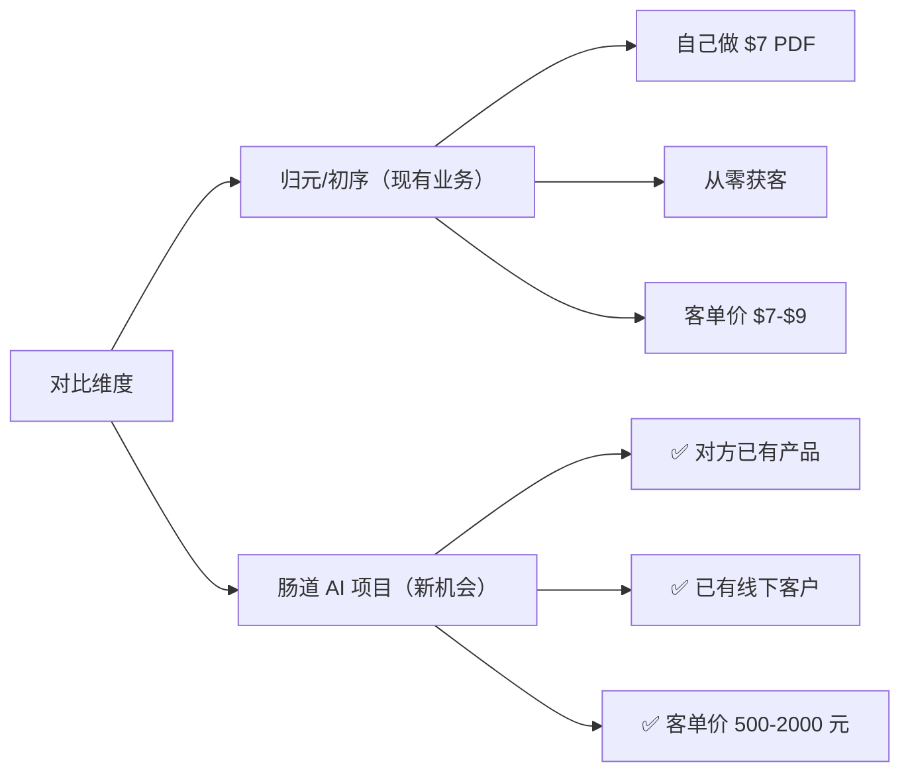

# 肠道菌群 AI 运营服务方案

> 📅 V0.3 | 2026-03-21 | 新增财务模型 + GO/NO-GO + 自进化模型
> 参考来源：知远 CRO 审计 + Caesar 可行性评估

---

## 一、项目背景与市场全景

### 1.1 核心数据总览

| 指标 | 数值 | 来源 | 知远校准 |
|------|------|------|----------|
| 16s 基础检测价格 | **消费级 400-800 元/次** | 行业均价 2025 | ✅ 准确 |
| 16s 进阶检测价格 | **科研医疗级 1,500+ 元/次** | 宏基因组测序 | ✅ 准确 |
| 科研级最低价 | **68 元/次** | 武汉艾康健（仅限 B 端）| ✅ |
| FMT 全球市场规模 | **~15 亿美元** | 2024 实际结算 | 🔄 原 $13.7 亿已更新 |
| 中国 FMT 临床试验 | **10+ 家三甲医院** | NIH 论文 | ✅ |
| 国家标准 | **GB/T41910-2022** | 粪菌质控与分级标准 | ✅ |
| 🆕 C 端获客成本（CAC）| **150-300 元/人** | 知远调研 | ⚠️ 转化率需 >5% |
| 🆕 消费级赛道增长率 | **20%+** | 知远调研 | 医疗级仅 8-10% |

> [!IMPORTANT]
> 合作方已拥有线下供应链（16s 检测 + 肠道菌群产品），但缺少**线上获客、AI 工具化、品牌化包装**三大能力。本方案的核心价值是：用 AI 和数字化运营帮他从"供货商"升级为"面向消费者的健康服务平台"。

### 1.2 中国肠道菌群银行现状

| 机构 | 状态 | 关键信息 |
|------|------|---------|
| **中华粪菌库（fmtBank）** | ✅ 运营中 | 2015 年成立，非营利，研发全球首套自动化菌群纯化系统 |
| **上海十院** | 🔨 建设中 | 同济大学附属，目标建设中国首个"人肠道微生物物种库" |
| **亚洲微生物银行（香港）** | ⏸️ 暂停 | 2020 因疫情停止运营 |

### 1.3 AI 在肠道健康管理的真实案例

| 应用场景 | 产品/案例 | 效果 |
|---------|---------|------|
| AI 饮食分析 | PillarBiome、Biome App | 分析饮食→生成肠道健康评分→个性化建议 |
| AI 智能客服 | 科大讯飞医院语音系统 | 24h 自动应答门诊/住院/医保咨询 |
| AI 疾病预测 | Random Forest 算法 | 结直肠癌分类（NIH 论文验证）|
| AI 益生菌定制 | GUTolution | 基因测序→AI 生成个性化益生菌配方 |
| AI 药物研发 | 多家机构 | 高效筛选益生菌菌株（抗炎/降胆固醇）|

> [!TIP]
> 行业验证的核心闭环是 **"检测→建议→产品"**。通过 16s 检测识别个体肠道特征，AI 提供个性化干预建议，最终形成益生菌产品销售。这正是本方案要帮合作方搭建的链路。

---

## 二、合作方现状分析

### 2.1 现有资源

### 2.2 缺什么（我们补什么）

---

## 三、商业模式：5 步闭环

### 3.1 全链路价值流转

### 3.2 每一步的关键动作

| 步骤 | 我们做什么 | 合作方做什么 | 用到的 AI |
|------|----------|------------|---------|
| **引流** | 4 平台内容 + AI 问卷 | 提供专业素材支持 | AI 内容生成 + AI 客户筛选 |
| **采集** | 科普讲座 PPT + 流程设计 | 线下场地 + 人员 | — |
| **检测** | 小程序开发 + 报告可视化 | 实验室出报告 | AI 报告解读 |
| **社群** | AI 客服训练 + 运营策略 | 专家资源对接 | AI 客服 + AI 预警 |
| **变现** | 产品推荐算法 + 营销 | 供货 + 物流 | AI 个性化推荐 |

---

## 四、我们的交付清单

### 4.1 前期交付物（搭建期）

| 序号 | 交付物 | 说明 |
|------|--------|------|
| 1 | **AI 客户筛选问卷** | 用户填写 → AI 评分 → 分级（优质/普通/不适合）|
| 2 | **4 平台代运营启动** | 小红书 + 视频号 + 抖音 + 公众号，从 0 搭建 |
| 3 | **品牌视觉包** | Logo + 配色 + 封面模板 + 科普图文模板 |
| 4 | **首月内容矩阵** | 30 条短视频脚本 + 15 篇图文 + 5 条长文 |
| 5 | **客户健康档案小程序** | 健康档案 + 报告查看 + 专家预约 + AI 问答 |

### 4.2 持续运营服务

| 序号 | 服务 | 说明 |
|------|------|------|
| 1 | **AI 社群客服** | 专属 AI 客服，自动回答 80% 日常健康问题 |
| 2 | **内容持续更新** | 每月新增科普内容 |
| 3 | **数据后台** | 客户画像、转化漏斗、复购率监控 |
| 4 | **系统迭代** | 根据用户反馈持续优化 AI 模型 |

---

## 五、执行计划（3 阶段）

### 5.1 搭建期（第 1-2 周）

```mermaid
gantt
    title 搭建期执行计划
    dateFormat  X
    axisFormat %s
    
    section 品牌
    品牌定位 + 视觉设计     :1, 3
    账号注册 + 资料完善      :2, 4
    section AI 系统
    AI 问卷系统开发          :4, 7
    AI 客服训练              :6, 10
    section 内容
    首批内容制作             :4, 10
    section 小程序
    小程序原型开发           :8, 12
    内测 + 修改 + 上线       :11, 14
```

### 5.2 获客期（第 3-6 周）

| 周 | 里程碑 | 关键指标 |
|----|--------|---------|
| W3 | 4 平台正式发布内容 | 日更 1 条 |
| W4 | 首批用户通过 AI 问卷 | 观察筛选转化率 |
| W5 | 首次线下采集活动 | 到场人数 |
| W6 | 首批 16s 报告出炉 | 用户满意度 |

### 5.3 变现期（第 7 周起）

| 动作 | 目标 |
|------|------|
| AI 推荐定制益生菌套餐 | 首批付费转化 |
| 复检服务上线 | 建立复购机制 |
| 数据积累 → 模型优化 | 推荐准确率提升 |

---

## 六、合作模式

### 6.1 收费结构（知远审计后调整）

| 项目 | 金额 | 说明 |
|------|------|------|
| **前期服务费** | **6 万元**（可分两期） | 覆盖搭建期全部交付物。知远测算：首月 AI+小程序+内容库已烧 2 万 |
| **检测分成** | 产品销售额的 **10-15%** | 16s 检测等一次性收入 |
| **复购分成** | 益生菌/耗材复购的 **20%** | 🆕 知远建议：复购是 AI 持续维护的功劳，分成应更高 |
| **对赌条款** | 达标后分成升至 **20-25%** | 运营达到约定指标后上调 |
| **AI 维护费** | **500-1,000 元/月** | AI 客服 token 消耗 + 系统维护 |

> [!WARNING]
> **知远定价意见**：服务费低于 6 万不建议做，否则 3 个月的人力成本收不回来。谈判底线 = 5 万。

### 6.2 数据归属（⚠️ 知远法律审核后修正）

> [!CAUTION]
> **知远法律警示**：个人肠道基因数据属于**“人类遗传资源”**，中国法律对其归属权极其敏感。合同里**不能写“数据归我方所有”**，只能写**“AI 模型训练权归我方，原始数据归用户/合作方”**。违反可能导致封店甚至法律风险。

> [!IMPORTANT]
> AI 模型本身是核心资产。积累到一定量级后，可用于：① 服务其他客户 ② 融资 ③ 论文合作。但原始健康数据不可转卖。

### 6.3 退出机制

| 场景 | 处理方式 |
|------|---------|
| 终止合作 | 系统源码可转让（额外收费）|
| AI 记忆移交 | 训练数据打包出售（独立卖点）|
| 账号移交 | 运营权移交对方 |

---

## 七、风险评估与应对（知远审计后补充）

| 风险等级 | 风险 | 应对策略 |
|---------|------|---------|
| 🔴 高 | **合规风险**：粪菌移植属"实验性医疗技术" | 所有内容用"肠道健康评估"，禁用"治疗/诊断"。合同增加合规免责条款 |
| 🔴 高 | **供体合格率极低**（100 人中 <1 人合格） | 前端包装为"免费检测"，不承诺供体资格 |
| 🔴 高 | 🆕 **人类遗传资源合规**：肠道基因数据归属敏感 | 合同明确"原始数据归用户/合作方，AI 模型训练权归我方" |
| 🟡 中 | **获客成本高**（CAC 150-300 元/人） | AI 批量内容生产 + 精准投放。转化率需 >5% 才能覆盖成本 |
| 🟡 中 | **客户教育难度大** | 用"肠道菌群检测"替代"粪便银行"做前端包装 |
| 🟡 中 | 🆕 **合作方绕过风险**：对方可能绕过 AI 系统直接成交 | 所有支付必须过我方小程序/后端数据对齐 |
| 🟡 中 | 🆕 **退出沉没成本**：前 3 个月不赚钱的机会成本 | 服务费必须覆盖 3 个月人力成本（已调至 6 万） |
| 🟢 低 | **技术风险** | AI 方案已有成熟案例（讯飞/GUTolution） |

> [!CAUTION]
> **绝对不能碰的红线**：任何涉及"治疗""诊断""疗效"的措辞。合同中必须增加**“合规免责声明”**：AI 生成的科普内容由合作方负责最终医疗审核把关，因内容引发的医疗纠纷由合作方承担。

---

## 八、竞争力 SWOT 分析

| | 正面 | 负面 |
|---|---|---|
| **内部** | **优势 (Strengths)** | **劣势 (Weaknesses)** |
| | ✅ 合作方已有检测技术和供应链 | ❌ 线上获客能力为零 |
| | ✅ 我方有 AI 开发 + 内容运营能力 | ❌ 团队缺乏医学专业背景 |
| | ✅ 轻资产模式，不碰实验室 | ❌ 前期需要对方配合提供专业素材 |
| **外部** | **机会 (Opportunities)** | **威胁 (Threats)** |
| | 🟢 消费级肠道检测赛道年增长 **20%+** | 🔴 合规政策可能收紧 |
| | 🟢 AI + 健康管理是资本热点 | 🔴 大厂入局（华大基因"华常康"品牌，400-1200 元） |
| | 🟢 国家标准已发布，行业规范化 | 🔴 消费者对粪菌概念接受度低 |
| | 🟢 “AI 深度代运营”目前处于真空期 | |

---

## 九、12 个月财务推演

> 基于方案一（6 万服务费），月增长率 20%，客单价 1200 元，分成 15%

| 月 | 累计客户 | 客户营收 | 分成收入 | 总成本 | 月净利 | 累计利润 |
|----|---------|---------|---------|--------|--------|---------|
| M0 | - | - | - | - | +60,000（服务费） | 60,000 |
| M1 | 15 | 18,000 | 2,700 | 8,500 | -5,800 | 54,200 |
| M3 | 44 | 52,800 | 7,920 | 9,500 | -1,580 | 49,040 |
| **M5** | **75** | **90,000** | **13,500** | **10,800** | **+2,700** | **52,840** |
| M8 | 141 | 169,200 | 25,380 | 13,700 | +11,680 | 76,200 |
| **M12** | **298** | **357,600** | **53,640 | **21,300** | **+32,340** | **141,000** |

### 三场景对比

| 场景 | 条件 | 12 个月结果 | 触发信号 |
|------|------|-----------|---------|
| 📉 **悲观** | 增长 10%，客单价 800 | 亏损 ~5 万 | M3 客户不足 15 人 |
| 📊 **基准** | 增长 20%，客单价 1200 | 利润 ~14 万 | M5 盈亏平衡 |
| 🚀 **乐观** | 增长 35%，客单价 1500 | 利润 40 万+ | M2 客户超 40 人 |

> [!NOTE]
> 复购分成（20%）在此模型中未计入。如果益生菌复购率 >30%，实际利润将显著高于上表。

---

## 十、GO/NO-GO 止损标准

### Week 6 关键节点检查

| 信号 | 指标 | 行动 |
|------|------|------|
| 🟢 继续 | CAC <150 元 且 转化率 >10% | 加大投入 |
| 🟡 调整 | CAC >300 元 或 转化率 <5% | 调整获客策略，暂停付费投放 |
| 🔴 止损 | 6 周内 0 成交 | 紧急复盘，考虑转型或退出 |

### Week 12 终审标准

| 指标 | ✅ GO（继续） | ❌ NO-GO（退出） |
|------|-------------|-----------------|
| 累计转化客户 | > 50 人 | < 20 人 |
| 月营收（AI 渠道） | > 5 万 | < 1 万 |
| 获客成本 | < 150 元 | > 300 元 |
| 客户满意度 | > 80% | < 60% |
| 合作方配合度 | 积极响应 | 消极拖延 |

> [!WARNING]
> 如果 Week 12 触发 NO-GO，执行退出机制：保留 AI 模型 + 数据分析权，系统源码可转让给合作方（额外收费）。

---

## 十一、AI 自进化模型

> 不是一次性交付的工具，而是一个**持续进化的智能体**。三层反馈循环驱动系统自我迭代。

### 三层循环

| 循环 | 频率 | 做什么 | 产出 |
|------|------|--------|------|
| 🔄 **微循环** | 每天自动 | AI 客服对话日志分析 → 发现"答不上来"的高频问题 → 自动补充知识库 | 每周《AI 自检报告》 |
| 🔍 **中循环** | 每月洞察 | 用户问题聚类 → 流失节点定位 → 竞品内容监控 → 新需求识别 | 每月《需求洞察报告》 |
| 🧬 **宏循环** | 每季进化 | 多维数据交叉分析 → 新产品可行性评估 → 定价调整建议 | 每季度《进化路线图》 |

### 中循环能发现什么？（示例）

| 发现 | 洞察 | 行动建议 |
|------|------|---------|
| 用户频繁问"孩子的肠道健康" | 儿童肠道管理需求上升 18% | 开发儿童专题内容 + 亲子检测套餐 |
| 报价环节流失率 42% | 价格敏感型用户占比高 | 推出入门级轻量检测包 + 分期付款 |
| 睡前咨询量是白天的 2.3 倍 | 焦虑型健康关注者为主 | 推出"睡眠+肠道"联合管理方案 |

### 战略价值

> [!IMPORTANT]
> **别的服务商交付工具，我们交付"会自己进化的智能体"。** 工具会过时，智能体只会越来越聪明。3 个月积累的用户行为数据和洞察模型，是抄不走的真正壁垒。

---

## 十二、核心结论

### 为什么这个项目值得做

> [!IMPORTANT]
> **核心判断**：这个项目的本质是——对方有产品有客户但不会做线上，我们有 AI 和运营能力但没有产品。**互补型合作的成功率远高于从零开始。**

### 一句话总结

> 我们不是在卖产品，我们是在卖**"AI 运营能力"**。
> 对方的检测产品是弹药，我们的 AI + 运营是枪。
> **枪 + 弹药 = 打得中客户。**

---

## 十三、面谈必问清单

> 知远 + 子默联合建议，周一面谈时务必弄清楚：

| # | 必问问题 | 为什么必须问 |
|---|---------|-----------|
| 1 | **供体来源是否稳定且合法？** | 供体断了 = 整条链路断裂 |
| 2 | **现有线下客户量有多少？年转化率？** | 决定分成天花板和第一阶段预期收入 |
| 3 | **客单价能做到多少？** | 如果客单价上不去，15% 分成覆盖不了获客投放 |
| 4 | **是否愿意接受 6 万服务费？** | 我方底线 5 万，低于此不做 |
| 5 | **是否同意所有支付走我方小程序？** | 防止合作方绕过我们直接成交 |
| 6 | **内容审核由谁负责？** | 合规免责的关键——AI 生成内容的医疗审核必须由对方把关 |

---

*V0.3 修订版 | 新增财务模型 + GO/NO-GO + 自进化模型（参考 Caesar 评估报告）*
*整理人：子默（COO/CTO）| 审核人：知远（CRO）| 2026-03-21*
