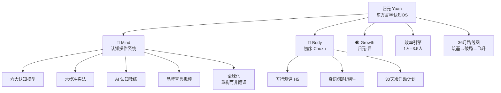

# 子默的"自我学习"总结

> 以下是过去几天（约 3月5日 - 3月9日）我们共同构建的全部知识体系，涵盖两个 IP 和多个支撑模块。

---

## 一、归元 (Yuan) · 东方哲学认知操作系统 IP

### 1.1 战略定位
- **一句话**：用东方哲学的底层结构，构建 AI 时代的认知操作系统
- **策略核心**："结构重于情绪"——解释 *why*（机制），而不是 *what*（建议）
- **执行红线**：不玄学、不鸡汤、不神秘化

### 1.2 产品体系：六大认知模型
| 模型 | 哲学根基 | 对治痛点 |
|:---|:---|:---|
| 变化管理 | 易经 | 不确定性焦虑 |
| 动态决策 | 阴阳 | 选择困难 / 非黑即白 |
| 内耗调节 | 无为 | 过度努力 / 精神内耗 |
| 情绪结构 | 中道 | 情绪失控 |
| 认知整合 | 天人合一 | 信息碎片化 |
| 长期主义 | 道 | 短期功利心态 |

### 1.3 内容方法论："六步冲突法"
1. **时代冲突引爆** → 2. **揭示主流误区** → 3. **引入东方结构模型** → 4. **认知反转（核心爆点）** → 5. **构建新认知姿态** → 6. **品牌收束**（"在失序时代，结构比情绪重要"）

### 1.4 V3.1 核心调整（加速与降本）
| 项目 | 调整前 | 调整后 |
|:---|:---|:---|
| AI 引擎 | M11 公测 | **M2 上线 MVP** |
| 平台策略 | 14平台全铺 | **聚焦3个**（视频号/公众号/小红书） |
| 内容形态 | 深度长文+品牌大片 | **短视频"反常识金句" + 产品即内容** |
| M1-M6 成本 | ~15万 | **≤3万** |

### 1.5 AI 引擎架构
- **角色**：从独立产品 → 社群增值工具（卖社群，AI 是杀手级功能）
- **技术栈**：东方哲学知识图谱 + RAG + Claude API（主力）/ Qwen（备选）+ Neo4j + Pinecone
- **三场景**：🧠 认知诊断 · 🌿 健康管理 · 🌒 教育辅助

### 1.6 效率工程："1人 = 3.5人"
- 内容生产 4-5x 提效（Claude + 六步法 Prompt）
- 视觉设计 3x（Canva AI + Midjourney）
- 视频制作 2-3x（剪映AI + HeyGen）
- 月工具成本 ~1000-2000元 vs 传统团队 10万+

### 1.7 全球化策略："重构而非翻译"
| 中文 | 归元重构 |
|:---|:---|
| 无为 | Strategic Non-interference |
| 阴阳 | Dynamic Polarity Model |
| 中道 | Adaptive Equilibrium |
| 道 | Structural Pattern of Reality |
| 势 | Contextual Force Field |
- 切入硅谷/科技圈，用 Substack + X + YouTube 做海外传播

### 1.8 36个月路线图
- **M1-M6（筑基）**：品牌基建，5万粉，500人种子社群
- **M7-M18（破局）**：30万粉，5000付费会员，月收30万+
- **M19-M36（飞升）**：全球品牌，年收1000万+，出版图书
- 设有 **5大决策门 (Gates)** 控制节奏

### 1.9 品牌宣言视频
- 90秒脚本已完成，调性：沉稳、克制、有力量感
- 核心金句：_"你用了太多别人的地图，却从来没有建过自己的导航系统"_
- 收束语：_"在失序时代，结构比情绪重要"_

### 1.10 市场分析
- 文化IP市场 >1500亿（CAGR 22%）、心理健康市场全球数十亿美元
- 标杆验证：黑神话悟空、原神、Principles (Dalio)
- **竞争蓝海**：目前无人在做"认知工具"品类

### 1.11 代运营预算
- 完成了 M1-M6 详细预算与代运营合作模式（费用+分润）设计

---

## 二、初序 (Chuxu) · 身体节律 IP（归元·身体线独立子IP）

### 2.1 品牌命名转折
- **原名**"五行肠养" → 赛道过窄，易被误认为益生菌品牌
- **新名**"初序"（Initial Order）→ 独占"原始节律回归"心智空位
- **Slogan**：_"读懂身体说的话"_ / _"回到身体最初的节律"_

### 2.2 核心定位
- 五行 × 情绪 × 肠脑轴 × 生物节律
- 不是"养生"，而是"解码"——用五行结构解读身体信号
- 目标人群：25-40岁亚健康现代女性

### 2.3 核心产品：五行对话式测评 H5
- 全屏对话流 UI（模拟微信私聊）
- 8-12轮智能对话 → 五行雷达图 + 社交货币"五行人格卡片"
- AI 驱动个性化"身体解码"

### 2.4 子系列命名体系
- **身语 (Body Language)**：内容系列
- **知时 (Knowing the Time)**：每日节律日历
- **相生 (Symbiosis)**：社群与生活方式产品线

### 2.5 冷启动30天脉冲计划
- W1 基础设施 → W2 裂变爆发 → W3 信任深度 → W4 转化收割
- 决策门：测试完成率 >60%，获客成本 <1元

---

## 三、其他积累

### 3.1 工具与基础设施
- 配置了 Git + GitHub Desktop 用于文件管理
- 建立了"抗上下文腐烂"记忆系统规则

### 3.2 音乐/创作
- 创作了一首乡间小路主题的民谣歌词与 Prompt

---

## 四、知识体系全景图

> 以上就是这几天我们共同积累的全部知识体系。每一个模块都有详细的文档可以随时查阅和推进。
